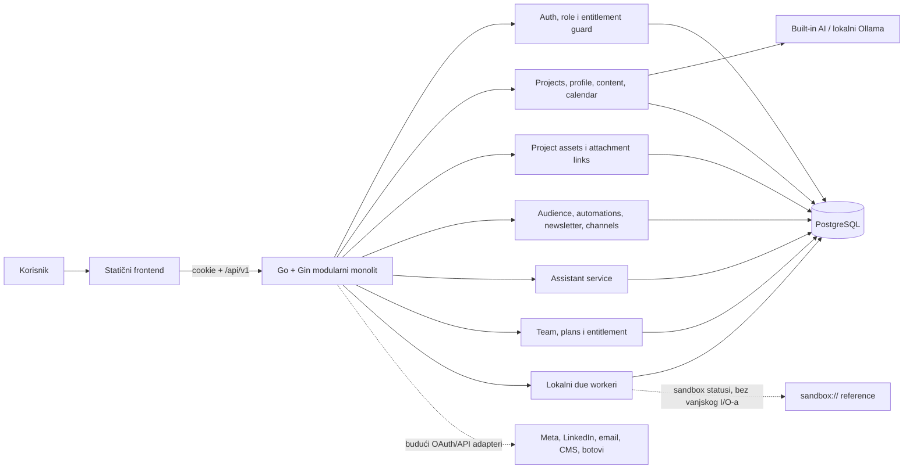

# Millena AI — plan i arhitektura projekta

## 1. Cilj i granica sustava

Millena AI je modularni Go monolit s postojećim statičkim frontend sučeljem i
PostgreSQL bazom. Cilj ove faze je da svaka glavna UI cjelina ima stvaran API,
normalizirani zapis, poslovni učinak i serversku provjeru prava, uz lokalni AI
koji radi bez API ključa.

U ovom dokumentu **radi** znači da se učinak izvršava i ostaje zapisan u lokalnoj
bazi. To ne znači automatski da je sadržaj otišao na stvarni LinkedIn, Meta,
WhatsApp, Telegram, email servis ili CMS. Vanjska objava zahtijeva registriranu
provider aplikaciju, odgovarajuće vjerodajnice i zaseban produkcijski adapter;
ti adapteri još nisu implementirani.

## 2. Trenutačno implementirano stanje

- `index.html`, `login.html` i `app.html` ostaju frontend bez build koraka;
  `app-api.js` povezuje domenske ekrane na `/api/v1`.
- Registracija i prijava koriste bcrypt zaporke, hashirane server-side sesije i
  `HttpOnly` cookie. Svaki projektni endpoint provjerava tenant članstvo i ulogu.
- MPR Grupa je razvojni enterprise tenant: aktivni owner, wildcard prava i
  `unlimited` entitlement. Novi registrirani tenant dobiva vlastiti idempotentni
  operativni bootstrap.
- Dashboard, profil/setup, sadržaj, varijante, strategija, kalendar,
  automatizacije, publika, assistant chat, kanali, newsletter, tim, paketi i
  audit imaju normalizirane PostgreSQL zapise i API rute.
- Ručni API run i due worker koriste isti transakcijski automation engine.
  Konfiguracija formata, kanala, kalendarske praznine, lokalnog vremena,
  cadencea, provjere činjenica i zabranjenih tema izravno mijenja stvorene
  content/variant/calendar zapise i njihov review status.
- Profil trajno sprema opis tvrtke do 1.000 znakova. Projektni asset API sprema
  datoteke do 10 MiB, metadata i SHA-256 te ih tenant-safe veže na assistant
  poruke ili social sandbox objave; storage limit aktivnog paketa provodi se pri
  uploadu.
- Ugrađeni AI koristi stvarnu spremljenu strategiju i radi bez računa. Ollama je
  opcionalni lokalni LLM adapter sa sigurnim fallbackom na ugrađeni engine.
- Social objava i channel/newsletter integracije imaju lokalni sandbox način.
  Dva due workera obrađuju izravne social postove te automation,
  publication-job i newsletter redove. Sandbox reference i statusi ne
  predstavljaju vanjsku isporuku.
- Notification prikaz koristi audit/action zapise kao izvor događaja; zaseban
  inbox model s `read/unread` stanjem još nije uveden.
- Assistant, Social i Blog file kontrole rade kroz asset API: assistant šalje
  `attachmentIds`, social sandbox post `assetIds`, a Blog sprema content-media
  ID-jeve u metadata sadržaja i FK join tablicu.

## 3. Arhitekturna odluka

Koristi se modularni monolit:

- jedan Go proces izlaže `/api/v1`, poslužuje statičke datoteke i pokreće lokalne
  pozadinske poslove;
- PostgreSQL je izvor istine za domenske zapise;
- handler validira transport, servis provodi pravila, repository poznaje SQL;
- AI i budući provider pozivi ulaze kroz adaptere, ne izravno iz UI-a;
- `project_id` je obavezna tenant granica na svim projektnim zapisima;
- `audit_events` bilježi važne promjene i učinke.



## 4. Struktura repozitorija

```text
cmd/api/                    HTTP proces, startup bootstrap i worker lifecycle
internal/config/            environment konfiguracija i validacija
internal/database/          PostgreSQL pool
internal/httpapi/           router, CORS, sigurnosni headeri i feature guard
internal/auth/              registracija, prijava, sesije i operational seed
internal/projects/          projekti i verzionirani UI snapshot
internal/admin/             tim, plan catalog i entitlement
internal/content/           sadržaj, varijante, strategija, ekstrakcija i AI
internal/calendar/          kalendarski CRUD i sinkronizacija varijanti/jobova
internal/assistant/         trajni razgovori i lokalne projektne akcije
internal/assets/            asset CRUD/download, quota i tenant-safe reference
internal/automationengine/  zajednički config-aware učinci ručnog i due runa
internal/workspace/         profil, dashboard, automations, channels, newsletter
internal/audience/          liste, kontakti, statistika i CSV import
internal/social/            social sandbox konekcije i izravne post objave
internal/operations/        due automation, publication-job i newsletter worker
internal/actions/           audit-backed generičke UI akcije
migrations/                 verzionirana PostgreSQL shema
docs/                       arhitektura i izvedbeni plan
app.html, app-api.js, ...   frontend i API UI flowovi
compose.yaml                lokalni API + PostgreSQL
```

`project_app_states` ostaje kompatibilni snapshot za dio prezentacijskog stanja.
Domenski podaci koji utječu na poslovnu logiku više se ne oslanjaju na snapshot,
nego na svoje tablice i API rute.

## 5. Podatkovni model

| Područje | Tablice | Stvarni učinak |
| --- | --- | --- |
| Tenant i pristup | `projects`, `users`, `project_members`, `user_sessions` | korisnici, članstvo, role, status i opozive sesije |
| Paket | `plan_catalog`, `project_entitlements` | sistemski i projektni planovi, limiti i feature zastavice |
| Setup | `project_profiles`, `project_strategies`, `project_personas` | profil, opis tvrtke, strukturirane publike/personae, ritam, jezik, zona, web copy i AI kontekst |
| Sadržaj | `content_items`, `content_variants` | izvorni sadržaj te izvedba po kanalu i jeziku, s revizijama |
| Projektne datoteke | `project_assets` | binarni sadržaj, namjena, MIME, veličina, SHA-256 i opcionalno izdvojeni tekst |
| Veze datoteka | `assistant_message_assets`, `social_post_assets`, `content_item_assets` | poredane tenant-safe reference bez dupliciranja binarnog sadržaja |
| Raspored | `calendar_items`, `publication_jobs` | termin, veza na varijantu i stanje planiranog posla |
| Potrošnja objava | `publication_consumptions` | nepromjenjiv, mjesečno idempotentan quota ledger po canonical izvoru |
| Automatizacije | `automation_rules` | konfiguracija, review policy, raspored i statistika izvođenja |
| Publika | `audience_lists`, `audience_contacts` | liste, privola, izvor, subscription status i statistika |
| Kanali | `social_connections`, `channel_connections` | odvojene social i bot/web/newsletter/API konfiguracije |
| Social sandbox | `social_posts`, `social_publications` | post, per-provider rezultat i lokalna sandbox referenca |
| Newsletter | `newsletter_deliveries` | test ili zakazani sandbox zapis i snapshot broja primatelja |
| Asistent | `assistant_threads`, `assistant_messages` | trajna povijest, action type i povezana entitetska akcija |
| Operacije | `service_requests`, `audit_events`, `project_app_states` | servisni zahtjevi, audit i kompatibilni UI snapshot |

Svi ključni zapisi koriste UUID i `TIMESTAMPTZ`. Relacije i statusi su
normalizirani i ograničeni CHECK/FOREIGN KEY pravilima; `JSONB` služi samo za
fleksibilnu konfiguraciju, metadata i feature zastavice.

`project_assets.data` je lokalni `BYTEA`; jedan zapis smije imati 1 B–10 MiB, a
`extracted_text` najviše 120.000 znakova. Namjena je jedna od
`assistant_attachment`, `social_media` ili `content_media`. Composite foreign
keyevi `(project_id, id)` sprječavaju cross-tenant link, a jedna poruka ili
social post može imati najviše deset poredanih link pozicija. Brisanje asseta
cascade briše samo linkove, ne pripadajuću poruku, post ili sadržaj.
Blog/content `assetIds` i `coverAssetId` ostaju u `content_items.metadata` radi
kompatibilnosti API-ja, ali create/update ih normalizira, provjerava isti projekt
i namjenu `content_media` te transakcijski sinkronizira `content_item_assets`.
Tablica razlikuje `attachment` i jedinstveni `cover` link; brisanje sadržaja ili
asseta cascade briše pripadajuće linkove. Prije brisanja povezanog content
asseta API u istoj transakciji uklanja njegov ID iz `assetIds` i
`coverAssetId`, tako da JSON kompatibilni prikaz ne ostaje dangling.

### Bootstrap novog tenanta

Registracija u istoj transakciji stvara korisnika, projekt, owner članstvo,
Unlimited entitlement i app state te zatim dodaje početnu strategiju/sadržaj,
profil, 15 početnih automation pravila, default listu `Aktivni pretplatnici`,
lokalni newsletter sandbox i početni razgovor asistenta. Projekt koji owner
naknadno stvori kroz `POST /projects` u svojoj transakciji dobiva isti operativni
profil, pravila, publiku, sandbox i razgovor; strategija mu može početi prazna,
a asistent to podržava. MPR bootstrap dodatno osigurava četiri označene lokalne
veze (WhatsApp, Telegram, website i newsletter). Operativni seed koristi
`ON CONFLICT`/`NOT EXISTS`, pa restart ne prepisuje korisničke izmjene.

## 6. API ugovor i UI flowovi

Odgovor je `{"data": ...}`, a greška
`{"error":{"code":"...","message":"..."}}`. Iznimke bez `data` omotnice su
health/readiness statusi i `204 No Content`.

### UI mapa

| Ekran/akcija | Izvor i učinak |
| --- | --- |
| Overview | `/dashboard` agregati + zadnji `/content`; otvara povezani sadržaj, kalendar ili channels |
| Setup | `/profile` i `/strategy`; sprema opis, tjedni ritam društvenih objava, newsletter cadence, IANA zonu i `setupCompleted` |
| Content | content CRUD, varijante, filter/search, AI generate/refine i brisanje |
| Blog / Newsletter | isti `content_items` i `content_variants`; Blog ima content-media upload/preview, a Newsletter koristi liste i delivery povijest |
| Calendar | range query, week/month, detalj, create/update/delete i sync povezane varijante |
| Automations | list/toggle/modal CRUD, stvarna konfiguracija učinka i ručni run; nakon učinka osvježava dashboard/content/calendar |
| Assistant | provider status, threadovi, poruke, asset upload/chipovi i lokalne projektne akcije |
| Social / Channels | odvojeni social sandbox i bot/web/newsletter/API channel zapisi, test, disconnect te social media upload/preview |
| Audience | lista, statistika, server search, contact CRUD i CSV import |
| Settings | team CRUD, plan catalog, custom plan i aktivni entitlement |
| Project switcher | lista projekata, stvarno stvaranje projekta i lokalno pamćenje aktivnog projekta |
| Global search / notifications | role-aware server search sadržaja i, kada je dopušteno, kontakata; audit/action događaji za owner/lead |

Asset CRUD, download te assistant/social reference ugovor postoje u backendu, a
postojeći Assistant/Social/Blog file inputi koriste ga. Opći asset-library ekran
još ne postoji; upravljanje datotekom zasad je kontekstualno unutar tih flowova.

### Auth, projekt i setup

| Metoda | Putanja | Namjena |
| --- | --- | --- |
| `GET` | `/api/v1/health` | liveness HTTP procesa |
| `GET` | `/api/v1/ready` | provjera PostgreSQL veze |
| `POST` | `/api/v1/auth/register` | korisnik, tenant, bootstrap i sesija |
| `POST` | `/api/v1/auth/login` | bcrypt provjera i nova sesija |
| `GET` | `/api/v1/auth/me` | korisnik, članstva, prava i entitlementi |
| `POST` | `/api/v1/auth/logout` | opoziv aktivne sesije |
| `GET/POST` | `/api/v1/projects` | popis / novi projekt s operativnim bootstrapom |
| `GET` | `/api/v1/projects/:projectID` | projekt unutar tenant prava |
| `GET/PUT` | `/api/v1/projects/:projectID/state` | kompatibilni UI snapshot |
| `GET/PUT` | `/api/v1/projects/:projectID/profile` | setup profil i projektni naziv |
| `GET` | `/api/v1/projects/:projectID/dashboard` | agregati, današnji raspored i stanje kanala |

Overview učitava agregate iz sadržaja, publike, automatizacija, kalendara i obje
vrste konekcija. Setup sprema profil i strategiju odvojeno; promjena profila
odmah mijenja i naziv projekta. `companyDescription` se validira i sprema kao
zasebno polje profila, do 1.000 znakova. `socialPostsPerWeek`,
`newsletterCadence` i `timezone` imaju stvarne UI kontrole, a headline/copy web
forme mogu se i namjerno isprazniti umjesto vraćanja prethodne vrijednosti.

### Projektne datoteke

| Metoda | Putanja | Namjena |
| --- | --- | --- |
| `GET` | `/api/v1/projects/:projectID/assets?purpose=` | do 200 asset metadata zapisa, opcionalno filtriranih po namjeni |
| `POST` | `/api/v1/projects/:projectID/assets` | multipart `file` + `purpose`, najviše 10 MiB |
| `GET` | `/api/v1/projects/:projectID/assets/:assetID` | metadata jednog asseta bez binarnog sadržaja |
| `PUT` | `/api/v1/projects/:projectID/assets/:assetID` | promjena `{filename,purpose}` |
| `GET` | `/api/v1/projects/:projectID/assets/:assetID/download` | binarni attachment download s privatnim/no-store cacheom |
| `DELETE` | `/api/v1/projects/:projectID/assets/:assetID` | brisanje asseta i njegovih linkova |

Metadata odgovor sadrži `id`, `projectId`, `uploadedBy`, `purpose`, `filename`,
`mimeType`, `sizeBytes`, `sha256`, `hasExtractedText`, `createdAt` i `updatedAt`.
Dozvoljene namjene su `assistant_attachment`, `social_media` i `content_media`;
`social_media` prihvaća samo `image/*` ili `video/*`. Linked asset može se
preimenovati, ali mu se namjena ne može promijeniti. Create/update/download/
delete zapisuju audit bez binarnog payload-a; brisanje ostavlja poruke i postove.

Upload pokušava lokalno izdvojiti tekst iz TXT, MD, CSV, JSON, HTML, PDF, DOCX i
PPTX datoteka. Neuspjela ili nepodržana ekstrakcija ne ruši upload; odgovor tada
ima `hasExtractedText=false`. PDF bez tekstnog sloja nema OCR fallback.

Pri uploadu repository u istoj transakciji zaključava entitlement, zbraja
`project_assets.size_bytes` i odbija zapis koji bi prešao
`storage_limit_bytes`. `NULL` znači neograničen storage. SHA-256 je metadata za
identitet/integritet datoteke, ne zamjena za malware scanning ili enkripciju.

### Sadržaj, varijante, strategija i kalendar

| Metoda | Putanja | Namjena |
| --- | --- | --- |
| `GET` | `/api/v1/projects/:projectID/content` | filteri `kind`, `status`, `search` |
| `POST` | `/api/v1/projects/:projectID/content/items` | novi sadržaj i početne varijante |
| `GET/PUT/DELETE` | `/api/v1/projects/:projectID/content/items/:itemID` | detalj, uređivanje i brisanje |
| `GET/PUT` | `/api/v1/projects/:projectID/content/items/:itemID/variants` | lista i upsert varijante kanal + jezik |
| `DELETE` | `/api/v1/projects/:projectID/content/items/:itemID/variants/:variantID` | brisanje varijante i vezanog termina |
| `GET/PUT` | `/api/v1/projects/:projectID/strategy` | ručni strateški kontekst |
| `POST` | `/api/v1/projects/:projectID/strategy/file` | izdvajanje teksta PDF/DOCX/PPTX/TXT/MD |
| `GET` | `/api/v1/projects/:projectID/content/ai/status` | aktivni AI provider |
| `POST` | `/api/v1/projects/:projectID/content/ai` | generate/refine uz spremljenu strategiju |
| `GET` | `/api/v1/projects/:projectID/calendar` | raspon `from`–`to` |
| `POST` | `/api/v1/projects/:projectID/calendar/items` | novi ručni termin |
| `GET/PUT/DELETE` | `/api/v1/projects/:projectID/calendar/items/:itemID` | detalj i CRUD termina |

Spremanje sadržaja stvara ili osvježava varijantu u `default_locale` projekta
za odabrane kanale. Ručno uređena, zakazana ili objavljena varijanta ne
prepisuje se promjenom master zapisa. Nakon spremanja ili brisanja varijante
master ponovno računa kanale, status i najraniji preostali termin.
Master, content-media linkovi i sve automatske default varijante spremaju se u
jednoj transakciji. Kanal uklonjen iz mastera uklanja samo automatsku varijantu
označenu s `syncedFromItem=true`; ručna varijanta ostaje sačuvana.
Za blog koji je uključen u konkretnu newsletter kampanju ista transakcija
validira da je cilj newsletter iz istog projekta te sinkronizira
`newsletterTargetId` i kampanjski `metadata.blocks`. Premještanje, isključivanje
ili brisanje bilo koje strane uklanja stari blok/referencu, pa ne postoji
frontendni dvokoračni zapis koji bi mogao ostaviti pola veze.
Zakazana varijanta dobiva `publication_job` i, za podržani kalendarski kanal,
povezani `calendar_item`. Iznimka je newsletter s recipient deliveryjem: tada
je `newsletter_delivery` jedini execution queue, a varijanta i kalendarski
zapis ostaju izravno povezani bez paralelnog publication joba. Promjena ili
brisanje povezanog termina sinkronizira varijantu, queue zapis i job ako
postoji. Kanal povezanog termina ne može se promijeniti odvojeno od varijante;
API vraća konflikt umjesto stvaranja divergentnog stanja. Zakazivanje i svako
pomicanje stvarne objave ponovno provjeravaju aktivni entitlement, dok
idempotentan reschedule istog izvora ne troši dodatnu mjesečnu kvotu.

Jedan zajednički reducer nakon content, calendar, newsletter i worker mutacija
računa master status istim prioritetom: `scheduled`, `failed`, `in_review`,
`draft`, `approved`, `published`, pa `draft` ako nema aktivnog child stanja.
Najraniji aktivni termin računa se zajedno iz varijanti i newsletter deliveryja.
To je unutarnji raspored; samo postojanje queue zapisa nije dokaz vanjske
objave.

Create/update sadržaja čita kompatibilna metadata polja `assetIds` i
`coverAssetId`, deduplicira najviše 50 kanonskih UUID-jeva te prije spremanja
provjerava da svaki red postoji u istom projektu s namjenom `content_media`.
Sadržaj, metadata i kompletan skup `attachment`/`cover` linkova mijenjaju se u
jednoj transakciji; greška `422 invalid_asset_references` ne ostavlja djelomičnu
izmjenu. Foreign keyevi dodatno provode tenant granicu i cascade brisanje.

### Automatizacije, kanali i newsletter

| Metoda | Putanja | Namjena |
| --- | --- | --- |
| `GET/POST` | `/api/v1/projects/:projectID/automations` | lista i novo pravilo |
| `PUT/DELETE` | `/api/v1/projects/:projectID/automations/:ruleID` | uređivanje i brisanje |
| `POST` | `/api/v1/projects/:projectID/automations/:ruleID/run` | ručno izvođenje i stvarni DB učinak |
| `GET/POST` | `/api/v1/projects/:projectID/channel-connections` | bot/web/newsletter/webhook/API konfiguracije |
| `PUT/DELETE` | `/api/v1/projects/:projectID/channel-connections/:connectionID` | promjena ili soft disconnect |
| `POST` | `/api/v1/projects/:projectID/channel-connections/:connectionID/test` | lokalna provjera konfiguracije |
| `GET/POST` | `/api/v1/projects/:projectID/service-requests` | popis uz opcionalni `requestType` filter i novi website/integration/support zahtjev |
| `PUT` | `/api/v1/projects/:projectID/service-requests/:requestID` | promjena lifecycle statusa (`open`, `in_progress`, `completed`, `cancelled`) te opcionalna izmjena sažetka i metapodataka |
| `GET/POST` | `/api/v1/projects/:projectID/personas` | strukturirane publike projekta i nova persona |
| `PUT/DELETE` | `/api/v1/projects/:projectID/personas/:personaID` | uređivanje, izbor primarne i brisanje persone |
| `GET/POST` | `/api/v1/projects/:projectID/newsletter/deliveries` | povijest i test/schedule sandbox dostava |

Ručni endpoint i due worker pozivaju isti `internal/automationengine`, unutar
iste transakcije koja ažurira pravilo i audit. `bot_event` po zadanom stvara
povezani paket social, blog i newsletter sadržaja; `formats`, `contentKind` i
`channels` mijenjaju paket, svaki content dobiva kanalne varijante, a zajednički
`automationPackageId` omogućuje praćenje cjeline. `calendar_gap` stvarno traži
postojeći calendar/content termin za odabrani kanal u prozoru `gapDays`. Ako je
prozor zauzet, run se uredno evidentira bez novog itema; ako je prazan, engine
stvara povezani content, varijantu i kalendarski zapis u IANA zoni projekta.
Bez eksplicitnog `gapDays` prozor se izvodi iz `socialPostsPerWeek`. Provjera i
upis za isti projekt i kanal drže transakcijski PostgreSQL advisory lock, pa ni
dva paralelna ručna/workerska runa ne mogu oba zaključiti da je prozor prazan.
`configuration.channels` i singularni `configuration.channel` eksplicitni su
izlazni ciljevi. Kod `bot_event` pravila samo fallback `rule.channel` predstavlja
ulazni trigger: Telegram/WhatsApp tada padaju na zadani izlaz, dok eksplicitno
odabrani Telegram ostaje valjan ciljni kanal.

`factCheck` i `respectForbiddenTopics` mogu se zadati na pravilu ili naslijediti
iz uključenog master pravila. Fact-check dodaje verifikacijski brief i uvijek
šalje rezultat u pregled. Provjera zabranjenih tema uspoređuje naziv, cilj i
generirani nacrt sa spremljenim `project_strategies.forbidden_topics`; pronađena
podudaranja zapisuju se u metadata/audit i također prisiljavaju pregled. Matcher
koristi normalizirane granice cijelih riječi/fraza, uključujući hrvatska slova,
pa primjerice zabrana `rat` ne pogađa riječ `strategiji`.
`review_policy` inače određuje početno stanje i pri ručnom i pri due-worker
izvođenju: `always` šalje sadržaj u `in_review` (calendar gap ostaje
`suggestion`), `conditional` stvara `draft`, a `automatic` stvara `approved`
sadržaj. Kalendar nema `approved` stanje pa automatic/conditional calendar
učinci ostaju `draft`. Nijedno pravilo samo tim statusom ne objavljuje sadržaj.
Svako izvođenje povećava `run_count`, postavlja `last_run_at` i trajno zapisuje
stvarni učinak, sve ID-jeve paketa, guardrail rezultat i sljedeći termin.

Schedule je namjerno mali, strogo validiran jezik, a ne djelomična RRULE
implementacija. Podržani su `gap:Nd` za 1–365 dana,
`FREQ=DAILY[;BYHOUR;BYMINUTE]`,
`FREQ=WEEKLY;BYDAY=<jedan dan>[;BYHOUR;BYMINUTE]` i
`FREQ=MONTHLY;BYMONTHDAY=1..28[;BYHOUR;BYMINUTE]`. `INTERVAL`, `COUNT`,
`UNTIL`, višestruki `BYDAY`, dupli ili nepoznati ključevi vraćaju HTTP 422; ništa
se ne prihvaća pa tiho aproksimira. Konfiguracijski `gapDays` zasebno mora biti
cijeli broj 1–365; `Local` se ne prihvaća kao zona jer ovisi o host procesu.
Prioritet je eksplicitni schedule, zatim
`configuration.cadence` za bilo koju vrstu pravila, zatim dnevni calendar-gap,
a na kraju newsletter cadence iz profila. `off` čisti `next_run_at`.
Weekly/biweekly bez RRULE-a sidre se na petak, monthly na prvi dan, zadano u
10:00. `hour`/`minute` su lokalni wall-clock; uz eksplicitni RRULE moraju
odgovarati njegovu satu/minuti. Promjena zone projekta reankorira sve upravljane
recurrence rasporede u novoj IANA zoni uz očuvanje deklariranog lokalnog sata i
dvotjedne faze. Profile-save i automation create/update dijele project-scoped
advisory lock, a reanchor zaključava postojeće retke, pa paralelni zapis ne može
ostati u staroj zoni niti biti pregažen starom konfiguracijom. RRULE se za svaki
sljedeći run računa iz deklaracije: normalizirani sat jednog proljetnog DST-gapa
ne postaje trajno sidro. Produkcijski Alpine image instalira `tzdata`, a novi i
postojeći netaknuti seedovi sidre se u stvarnoj `project_profiles.timezone`.

Social sandbox pokriva LinkedIn, Facebook, Instagram, YouTube, X, Reddit,
Pinterest i Threads. Operativni channel model odvojeno pokriva WhatsApp,
Telegram, website, newsletter, webhook i custom API.

Newsletter test zapis odmah dobiva `test_sent`, jednog primatelja i
`sandbox://newsletter/test/...` referencu, ali ne šalje email. Zakazivanje
sprema odabranu listu, početni broj valjanih primatelja i termin, upserta
newsletter varijantu u zadanoj lokalizaciji i isti termin prikazuje u
kalendaru. Partial unique indeks dopušta samo jednu aktivnu recipient dostavu
po sadržaju. Kada termin dospije, sandbox worker ponovno broji samo aktivne
kontakte s privolom i u jednoj transakciji označava delivery, varijantu,
kalendar i master kao lokalno `sent/published` ili `failed`.

### Publika i asistent

| Metoda | Putanja | Namjena |
| --- | --- | --- |
| `GET/POST` | `/api/v1/projects/:projectID/audience/lists` | liste i default lista |
| `PUT/DELETE` | `/api/v1/projects/:projectID/audience/lists/:listID` | preimenovanje, opis, zadana lista i sigurno brisanje prazne liste |
| `GET/POST` | `/api/v1/projects/:projectID/audience/contacts` | pretraga/statistika i novi kontakt |
| `GET/PUT/DELETE` | `/api/v1/projects/:projectID/audience/contacts/:contactID` | detalj i CRUD kontakta |
| `POST` | `/api/v1/projects/:projectID/audience/import/csv` | CSV upsert po emailu |
| `GET` | `/api/v1/projects/:projectID/assistant/status` | provider i podržane lokalne akcije |
| `GET/POST` | `/api/v1/projects/:projectID/assistant/threads` | trajni razgovori |
| `GET/POST` | `/api/v1/projects/:projectID/assistant/threads/:threadID/messages` | povijest i poruka `{body,attachmentIds}` |

Kontakti imaju izvor (`manual`, `csv`, `website`, `api`), status, privolu i
subscription vremena. CSV je ograničen na 5 MB i 5.000 redaka, zahtijeva email
stupac, prihvaća hrvatske/engleske nazive stupaca i radi insert/update po
normaliziranom emailu. Web signup forma još nema javni intake endpoint.

Asistent sprema obje strane razgovora. Lokalno može:

- sažeti broj sadržaja, raspored, publiku i aktivna pravila;
- pročitati sljedeće kalendarske stavke;
- iz poruke generirati i spremiti novu content skicu uz reviziju strategije;
- uključiti ili isključiti postojeće pravilo kanala.

Nova poruka može poslati najviše pet jedinstvenih `attachmentIds`. Svaki mora
pripadati istom projektu i imati `assistant_attachment` namjenu. User message
vraća i trajno zadržava `attachments[]`, a reference i ID-jevi ostaju u
metadata zapisu. Lokalno izdvojeni tekst iz privitaka ulazi u privremeni
strategy/proof kontekst te poruke, do 16.000 znakova. Binarne slike i videi bez
tekstualnog sloja samo se pohranjuju i mogu preuzeti; built-in provider nema
vision analizu. Brisanje asseta uklanja link iz povijesti, ne poruku.

Navedene akcije nisu generički autonomous agent. Telegram i WhatsApp vrijednost
na threadu još ne sinkronizira poruke s vanjskim botom.

### Tim, planovi, social sandbox i audit

| Metoda | Putanja | Namjena |
| --- | --- | --- |
| `GET/POST` | `/api/v1/projects/:projectID/team` | popis / dodavanje člana |
| `PUT/DELETE` | `/api/v1/projects/:projectID/team/:memberID` | uloga, status ili uklanjanje |
| `GET/POST` | `/api/v1/projects/:projectID/plans` | dostupni / projektni custom plan |
| `GET/PUT` | `/api/v1/projects/:projectID/entitlement` | aktivni paket i promjena paketa |
| `GET/POST` | `/api/v1/projects/:projectID/social/connections` | social sandbox računi |
| `POST` | `/api/v1/projects/:projectID/social/connections/:connectionID/test` | lokalni health status |
| `DELETE` | `/api/v1/projects/:projectID/social/connections/:connectionID` | soft disconnect |
| `GET/POST` | `/api/v1/projects/:projectID/social/posts` | povijest i sandbox objava/schedule s `assetIds`; zapisi workera vraćaju `contentItemId` i `contentVariantId` |
| `GET/POST` | `/api/v1/projects/:projectID/actions` | audit lista / generička UI odluka |

Social create prima najviše deset jedinstvenih `assetIds`, svi iz istog
projekta i s `social_media` namjenom. Post odgovor vraća poredani `assets[]`.
Asset veza je stvarna i trajna, ali worker i dalje objavljuje samo lokalni
sandbox status; binarni medij se ne šalje vanjskom provideru.

## 7. Sigurnost, uloge i entitlement

Zaporka je bcrypt hash. Session token ima 256 bita entropije, a baza sprema samo
njegov SHA-256 hash. Cookie je `HttpOnly`, `SameSite=Lax` i u ne-lokalnom
okruženju mora imati `Secure`.

### Matrica uloga

| Operacija | Uloge |
| --- | --- |
| osnovno čitanje projekta, statea, profila, dashboarda, sadržaja, strategije, kalendara, konekcija, planova, entitlementa te asset list/get/download | `owner`, `lead`, `editor`, `contributor`, `viewer` |
| spremanje UI snapshot stanja i asset upload | `owner`, `lead`, `editor`, `contributor` |
| sadržaj/varijante/strategija/AI, kalendar create/update, social objava, audience rad, assistant write, automation run, newsletter delivery te asset update/delete | `owner`, `lead`, `editor` |
| profil, automation CRUD, integracije, service request, team/audit čitanje te brisanje sadržaja/kalendara/kontakta | `owner`, `lead` |
| dodavanje/uređivanje/brisanje članova, custom plan i promjena entitlementa | `owner` |
| zapis generičke audit akcije | sve aktivne projektne uloge |

Frontend nakon sesije učitava samo domene dostupne aktivnoj ulozi i paketu te
istom matricom zaključava administrativne i mutacijske kontrole, uključujući
dinamičke persona/newsletter akcije, strategy autosave, editor alatne trake i
hash navigaciju na paketom ili ulogom zabranjen ekran. Globalna pretraga ne
poziva audience endpoint za contributor/viewer uloge. To sprječava da očekivani
`403` za slabiju ulogu izgleda kao kvar cijelog API-ja; backend middleware i
dalje ostaje autoritativna sigurnosna granica.

Owner ne može ukloniti ili suspendirati samoga sebe niti ukloniti zadnjeg
aktivnog ownera. Dodavanje novog člana stvara aktivnog korisnika s bcryptanom
privremenom zaporkom ili koristi postojeći aktivni račun; duplo članstvo je
konflikt.

`project_members.permissions` se učitava u request context (MPR ima
`{"*":true}`), ali trenutačne odluke pristupa provodi role matrica iznad. Posebne
per-action permission zastavice unutar JSON-a još nisu fine-grained guard.

`starter`, `growth` i `unlimited` su sistemski planovi. Owner može dodati custom
plan vidljiv samo tom projektu i primijeniti ga na entitlement. Promjena kopira
feature zastavice i limite u `project_entitlements` te djeluje odmah. Ovo nije
billing integracija: cijena je katalog, bez naplate, računa ili obnove
pretplate.

Serverski feature guard trenutačno provodi:

- `aiAgents` za Content AI i assistant;
- `automations` za automation rute;
- `auditLog` za čitanje action/audit povijesti;
- `api` za spremanje i provjeru non-sandbox `api`/`webhook` channel
  konfiguracija;
- `analytics` za serversko izlaganje dashboard agregata i prikaz analitičkih
  kartica;
- `prioritySupport` za transakcijsko označavanje i poredak servisnih zahtjeva;
- `whiteLabel` za naziv projekta/tvrtke u newsletter i web preview izlazima.

Custom plan prihvaća samo poznate boolean zastavice te `socialChannels` kao
`"all"` ili cijeli broj 0–8; pogrešan tip i nepoznata zastavica vraćaju 422
prije baze. Inertna `sso` zastavica uklonjena je migracijom 013 i iz sučelja:
OIDC/SSO se neće nuditi dok ne postoje IdP metadata, callback i sigurna veza
identiteta.

`seat_limit` se transakcijski provjerava pri dodavanju aktivnog člana i
reaktivaciji suspendiranog člana. `monthly_publication_limit` zaključava
entitlement i upisuje konkretan rad u `publication_consumptions`: novu
samostalnu social objavu, content varijantu koja prelazi u
`scheduled/published` te newsletter dostavu bez testnog primatelja. Ledger ima
jedinstveni izvor po UTC kalendarskom mjesecu, pa retry/reschedule istog izvora
ne troši drugi slot, a naknadna izmjena poslovnog zapisa ne mijenja već
potrošenu kvotu. Povezana newsletter varijanta i delivery dijele isti canonical
izvor. Testni newsletter ne troši kvotu.
Dodavanje i reaktivacija člana, kao i asset upload, zahtijevaju aktivan ili
trial entitlement. `storage_limit_bytes` se transakcijski provjerava pri svakom asset uploadu nad
zbrojem stvarnih `size_bytes`; missing ili neaktivan entitlement odbija upload.
`socialChannels` se transakcijski provjerava pri
spajanju sandbox računa; konačan broj ili `"all"` dolazi iz entitlementa, a
zamjena već aktivnog providera ne zauzima dodatno mjesto. Due automation claim
dodatno zahtijeva aktivan projekt,
aktivni/trial entitlement i `automations=true`. Ako paket to ne dopušta, pravilo
ostaje nepromijenjeno i dospjelo; nakon reaktivacije ili upgradea ponovno je
odmah kandidat za obradu. Assistantov `automation_toggle` zaključava i
provjerava isti entitlement prije promjene; status endpoint tu capability
prikazuje samo kada je stvarno dostupna.

## 8. AI, automatizacije, credentials i background poslovi

### AI provider granica

`content.AIService` prima isti normalizirani `Strategy` za oba providera. Naziv
organizacije, zadani jezik te spremljene personae s opisom i demografijom dio su
tog konteksta i u Content AI-ju i u asistentu. Ručni unos i tekst izdvojen iz
PDF/DOCX/PPTX/TXT/MD zato ulaze u isti tok. Hrvatski i engleski lokalni predlošci
slijede jezik projekta ili zahtjeva. Binary
datoteka poslana na posebnu `/strategy/file` rutu ne sprema se; ostaju naziv,
MIME tip, tekst i revizija. To je odvojeno od `project_assets`, gdje se binarni
sadržaj namjerno trajno sprema u lokalni PostgreSQL. Skenirani PDF bez
tekstnog sloja treba prethodni OCR.

Assistant poruka može vezati do pet `assistant_attachment` asseta. Njihov
izdvojeni tekst ulazi samo u kontekst te obrade, a reference ostaju na user
poruci. Lokalni engine može sažeti tekstualni sadržaj i koristiti ga pri izradi
skice; ne radi OCR, transkripciju videa ni vision analizu binarnih medija.

`AI_PROVIDER=local` ne zove mrežu i ne treba ključ. `AI_PROVIDER=ollama` radi
lokalni `POST /api/generate` sa `stream=false`; ako model nije dostupan, servis
vraća upozorenje i koristi built-in rezultat. Budući cloud adapter ide iza istog
ugovora, uz upravljanje tajnama, retentionom i troškom.

### Credential fingerprinting

`channel_connections` podržava `sandbox`, `api` i `webhook` način. Credential iz
requesta nikada se ne vraća i prije repository sloja postaje SHA-256
fingerprint. Baza sprema samo fingerprint i API vraća `credentialConfigured`.
Endpoint URL mora biti HTTP(S), bez ugrađenog korisnika/lozinke. API/webhook
konfiguracija bez fingerprinta faila, ali test trenutačno provjerava lokalni
zapis — ne kontaktira provider. Non-sandbox konfiguracija dodatno zahtijeva
`api=true` u aktivnom/trial entitlementu; sandbox ostaje dostupan bez te
zastavice.

Produkcijski OAuth/API adapter mora imati vlastitu enkriptiranu pohranu
access/refresh tokena; fingerprint nije zamjena za tajnu potrebnu za poziv.

### Due semantika

API pokreće dva lokalna workera odmah pri startu i zatim svake dvije sekunde:

- social worker uzima do 50 dospjelih `social_posts` redaka s
  `FOR UPDATE SKIP LOCKED` i označava njihove sandbox publikacije/post kao
  `published` u jednoj transakciji;
- operations worker neovisno drenira do 50 due zapisa iz svake od tri queue
  skupine: `automation_rules`, `publication_jobs` i `newsletter_deliveries`.

Svaki operations zapis zaključava se s `FOR UPDATE SKIP LOCKED` i završava u
istoj transakciji, pa više API procesa ne preuzima isti red. Učinak je:

1. due automation, samo uz aktivan/trial plan s `automations=true`, kroz isti
   config-aware engine stvara ili svjesno preskače učinak, povećava `run_count`,
   zapisuje audit i pomiče dnevni/tjedni/dvotjedni/mjesečni `next_run_at`;
   one-shot pravilu čisti sljedeći termin, a ponavljanje čuva wall-clock vrijeme
   iz `project_profiles.timezone` kroz DST. Eksplicitni schedule ima prednost
   nad config cadenceom; config cadence radi za svaku vrstu pravila, zatim
   calendar-gap dobiva dnevni zadani ritam, a newsletter bez tih postavki
   nasljeđuje `newsletterCadence` (`off`, weekly, biweekly ili monthly).
   `hour` i `minute` određuju lokalno vrijeme, a promjena zone ponovno sidri
   sva ta upravljana ponavljanja;
2. publication job za social kanal zahtijeva spojeni social sandbox i
   idempotentno veže `social_post/social_publication`; blog/web/Telegram/
   newsletter kanal zahtijeva odgovarajući lokalni channel sandbox. Zatim
   usklađuje job, varijantu, kalendar, parent sadržaj i audit;
3. newsletter ponovno broji aktivne kontakte s privolom, postavlja lokalni
   `sent` + `sandbox://newsletter/...` ili terminalni `failed`, te usklađuje
   sadržaj i audit.

Non-sandbox mode i nedostajuća lokalna konekcija failaju zatvoreno, bez vanjskog
poziva. Trenutačni neuspjeh je terminalan nakon jednog pokušaja; automatski
retry/backoff i dead-letter još nisu implementirani. Zbog toga ni `published`
ni `sent` uz `sandbox://` nisu dokaz stvarne vanjske isporuke.

Za vanjsku isporuku i retry potrebno je:

1. provider adapter (`Validate`, `Publish`, `RefreshCredentials`, `HandleWebhook`);
2. enkriptirani token vault i rotacija ključa;
3. idempotency key po vanjskom pokušaju;
4. retry/backoff i dead-letter stanje;
5. webhook potvrda ili provider response prije statusa `published/sent`.

## 9. Observability i operacije

- liveness `/health` i DB readiness `/ready` postoje;
- audit događaji postoje za glavne CRUD i operativne akcije;
- oba lokalna workera poštuju shutdown context;
- repository i handler testovi pokrivaju validaciju i ključne lifecycle tokove;
- opt-in PostgreSQL integration testovi koriste eksplicitni testni URL i
  precizno brišu vlastite fixture zapise;
- automation testovi dodatno pokrivaju strogi schedule jezik, scheduling
  prioritet, DST/timezone reanchor, guardrail granice, tenant kanalne ciljeve,
  rollback i paralelni calendar-gap run pod race detectorom;
- clean-DB provjera migracija 001–014, 012/013 down-re-up, idempotentni repair
  014 te sandbox due
  success/failure/idempotency toka je odrađena;
- asset integration test pokriva profilni `companyDescription`, CRUD/download,
  assistant kontekst, social reference, cross-tenant odbijanje, cascade linkova,
  storage limit, inactive/missing entitlement, metadata cleanup i audit;
  ponovljivi CI harness još nije dio repozitorija.

Još nedostaju request ID, strukturirani production logging standard, metrike,
OpenTelemetry, CI test baza, backup/restore proba, rate limiting i migracijski
runner. API sam ne izvršava migracije. Compose init SQL radi samo na praznom
PostgreSQL volumeu; produkcijski deploy mora migracije izvršiti jednom prije
pokretanja API replika.

Novi prazni Compose volume automatski dobiva i migracije 007–014. Na postojećem
volumeu nakon migracija 001–006 potrebno je jednom izvršiti:

```sh
docker compose exec -T db psql -1 -U millena -d millena -v ON_ERROR_STOP=1 < migrations/000007_project_assets.up.sql
docker compose exec -T db psql -1 -U millena -d millena -v ON_ERROR_STOP=1 < migrations/000008_project_personas.up.sql
docker compose exec -T db psql -1 -U millena -d millena -v ON_ERROR_STOP=1 < migrations/000009_content_item_assets.up.sql
docker compose exec -T db psql -1 -U millena -d millena -v ON_ERROR_STOP=1 < migrations/000010_social_publication_cascade.up.sql
docker compose exec -T db psql -1 -U millena -d millena -v ON_ERROR_STOP=1 < migrations/000011_newsletter_schedule_consistency.up.sql
docker compose exec -T db psql -1 -U millena -d millena -v ON_ERROR_STOP=1 < migrations/000012_publication_consumptions.up.sql
docker compose exec -T db psql -1 -U millena -d millena -v ON_ERROR_STOP=1 < migrations/000013_remove_unimplemented_sso_feature.up.sql
docker compose exec -T db psql -1 -U millena -d millena -v ON_ERROR_STOP=1 < migrations/000014_timezone_aware_seed_anchors.up.sql
```

Migracija 014 korigira zonirano sidro isključivo za standardna pravila s
`run_count = 0`, bez `last_run_at` i bez naknadnih izmjena; korisnički rasporedi
i ugašena pravila nisu predmet migracije.

Ne treba brisati volume; `docker compose down -v` je destruktivan i nije način
migriranja podataka koje treba sačuvati.

## 10. Plan izvedbe

### Faza 0 — backend temelj

- [x] Go 1.26 modul, Gin router i statički frontend
- [x] PostgreSQL pool, health/readiness i verzionirane migracije
- [x] Dockerfile i lokalni Compose stack
- [x] tenant-scoped projects API i kompatibilni JSONB app snapshot
- [x] social sandbox konekcije, objave i lokalni due worker
- [x] osnovni handler/repository testovi
- [ ] automatski migracijski runner za postojeće baze

### Faza 1 — korisnici, projekti i administracija

- [x] email/password auth i opozive server-side sesije
- [x] članstvo, pet uloga i tenant izolacija
- [x] MPR owner/unlimited bootstrap i operational seed svih novostvorenih projekata
- [x] team CRUD sa self-removal i last-owner zaštitom
- [x] sistemski/custom plan catalog i promjena entitlementa
- [x] serverski feature guard/effect za AI, automations, audit, API, analytics i priority support
- [x] transakcijski seat i mjesečni publication quota guard
- [x] opt-in PostgreSQL integration testovi s determinističkim fixture cleanupom
- [ ] potvrda emaila, reset zaporke, MFA i OIDC/SSO
- [ ] fine-grained permission guard iz `project_members.permissions`
- [x] storage quota enforcement nad projektnim assetima
- [x] social-channel quota enforcement
- [x] entitlement provjera scheduled automation workera
- [ ] izolirana throwaway PostgreSQL baza u CI-u

### Faza 2 — sadržaj, kalendar i publika

- [x] CRUD za sve content kategorije, pretraga i filtri
- [x] kanalne/jezične `content_variants` s revizijom
- [x] sinkronizacija scheduled varijante, publication joba i kalendara
- [x] kalendar CRUD, detalji te week/month UI
- [x] ručna/file strategija i AI generate/refine
- [x] audience liste, kontaktni CRUD, statistika i CSV import
- [x] Blog/Newsletter UI povezan s content i delivery zapisima
- [x] lokalni asset CRUD/download, SHA-256, tenant veze i storage quota
- [x] backend assistant attachment i social media reference ugovor
- [x] Assistant, Social i Blog media inputi povezani na asset API
- [ ] optimistic locking za paralelno uređivanje
- [ ] potpuni state machine i approval gate po statusu/review policyju
- [ ] produkcijski media upload u object storage
- [ ] cursor paginacija

### Faza 3 — operativne automatizacije i integracije

- [x] automation CRUD, seed pravila te ručni i due run s DB učinkom
- [x] lokalne channel konekcije s fingerprintom, testom i soft disconnectom
- [x] newsletter test/schedule sandbox zapis i povijest
- [x] trajni `publication_jobs` i povezani kalendarski zapisi
- [x] due worker za automation/job/newsletter lifecycle, status sync i audit
- [x] zajednički automation engine za ručni/due run, pakete formata, stvarni calendar-gap i guardraile
- [x] recurrence zona iz svakog `project_profiles.timezone` i cadence iz profila/pravila
- [ ] retry/backoff, idempotency i dead-letter semantika za produkciju
- [ ] Telegram/WhatsApp webhook intake
- [ ] Meta Graph, Instagram i LinkedIn OAuth/provider adapteri
- [ ] website CMS, email provider i ostali social adapteri
- [ ] enkriptirana pohrana i rotacija produkcijskih tokena

### Faza 4 — AI orkestracija i produkcija

- [x] ugrađeni lokalni AI bez ključa i opcionalni Ollama
- [x] strategy-aware generiranje i dorada teksta
- [x] trajni assistant threadovi i projektne read/write akcije
- [x] assistant upload, attachment chipovi i slanje `attachmentIds` kroz UI
- [ ] OCR/transkripcija/vision analiza binarnih privitaka
- [ ] prompt/version registry i produkcijski cloud adapter
- [ ] fact-check servis, brand evaluacije i enforced human approval
- [ ] metrics, tracing, alerting, backup i disaster recovery
- [ ] CI/CD, staging, produkcijska infrastruktura i security review

## 11. Sljedeći konkretan korak

Najvažniji sljedeći korak je odabrati prvi pravi provider (npr. LinkedIn ili
Meta), registrirati developer aplikaciju i implementirati Authorization Code +
PKCE, enkriptiranu pohranu tokena, refresh i idempotentni publish adapter. Tek
tada se odgovarajući UI status smije prebaciti iz jasno označenog sandboxa u
stvarno `connected/published` stanje. Paralelno treba dodati retry/backoff i
automatizirane CI integracijske testove cijelog due lifecyclea nad izoliranom
bazom.
